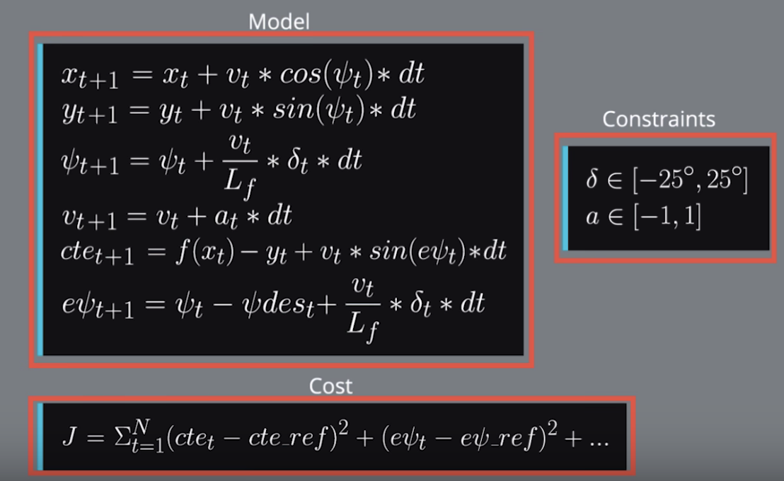

# MPC
Model Predictive Control

## Model Description 

The kinematic model could best be described as the following formula.

The program also defines cost function using cross track error, orientation error values
together with a few other cost functions to address specific issues. 
Then it uses ipopt to compute orientation and actuator.

## Parameters Chosen
The weight are chosen simply based on try and check video result. 
```cpp
   for (int t = 0; t < N; t++) {
      fg[0] += 500 * CppAD::pow(vars[cte_start + t], 2);
      fg[0] += 500 * CppAD::pow(vars[epsi_start + t], 2);
      fg[0] += CppAD::pow(vars[v_start + t] - ref_v, 2);
    }
    for (int t = 0; t < N - 1; t++) {
      fg[0] += 500*CppAD::pow(vars[delta_start + t], 2);
      fg[0] += 50*CppAD::pow(vars[a_start + t], 2);
    }
    for (int t = 0; t < N - 2; t++) {
      fg[0] += 300000 * CppAD::pow(vars[delta_start + t + 1] - vars[delta_start + t], 2);
      fg[0] += 5000 * CppAD::pow(vars[a_start + t + 1] - vars[a_start + t], 2);
    }
```
For 
   * N (timestep length) is chosen as a tradeoff between computational cost and model quality. 10 is a number that works well.
   * dt is also a tradeoff between computational cost and how frequent we want actuations to be. Since we need to handle 100ms delay, 0.1 is a good number.

## Polynomial Fitting and MPC Preprocessing
The waypoints are transformed to vehicle coordinate system. They are then used to fit a 3rd order polynomial. 

## Model Predictive Control with Latency
Since we chose dt to be 0.1, we use the a/delta one step before so that it could take care of 100ms latency.
```cpp
    if (t > 1) {
        a0 = vars[a_start + t - 2];
        delta0 = vars[delta_start + t - 2];
    }
```

## Video
[video](https://github.com/baihongjie/selfdrivingcar/blob/master/MPC/result.mp4).
 
